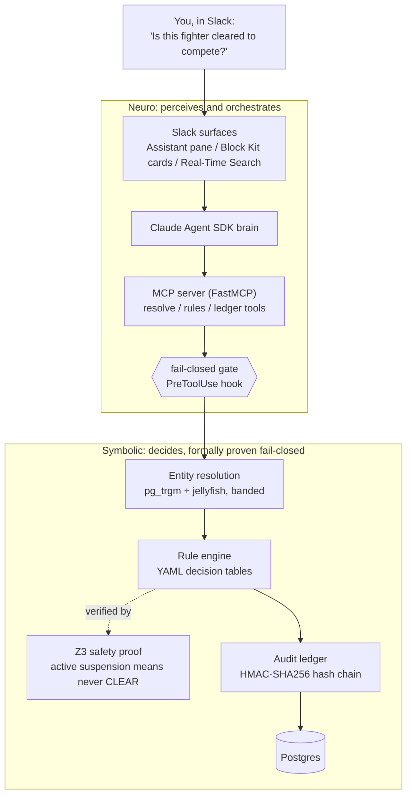

# Architecture

CornerCheck is a neurosymbolic system: the language model perceives natural language and
orchestrates tools, but a deterministic, formally-verified symbolic core decides clearance.
The model proposes; the proven symbolic core disposes. That separation is what lets the
fail-closed guarantee be code, not a prompt.

## The three fail-closed locks

The "fail-closed guarantee" is not a single check. Three independent mechanisms each block a
wrong clearance, so no single failure can produce one:

1. **In-tool engine re-check.** The ledger-write tool re-runs the rule engine and refuses any
   decision that contradicts it. Refused writes (including malformed-id probes) are themselves
   ledgered.
2. **PreToolUse hook.** The agent cannot write a clearance unless this thread confirmed this
   fighter and the recorded verdict matches the decision being written. Deterministic code; the
   model cannot talk its way around it.
3. **Deterministic pipeline.** The Slack card renders from the deterministic
   Retrieve, Disambiguate, Clear pipeline, never from model prose. Ambiguous identity or no
   match never reaches the rule engine.

## Verification

The clearance decision logic is checked by Z3 (`scripts/z3_proof_demo.py`): the engine's
suspension-window membership is proven equivalent to an independently-written safety
specification over all dates and intervals, so if a suspension is active, the engine can never
return CLEAR. The proof is not a tautology (an in-suite mutation test confirms it catches
engine corruption), and it surfaced a real fail-open bug (a malformed `end < start` date range
that silently cleared a suspended fighter), now fixed to fail closed.

## Diagram assets

Rendered presentation versions of this diagram and the demo title/end cards live in
`docs/demo-assets/` (1920x1080 PNGs, regenerable from the committed HTML with headless Chrome).
